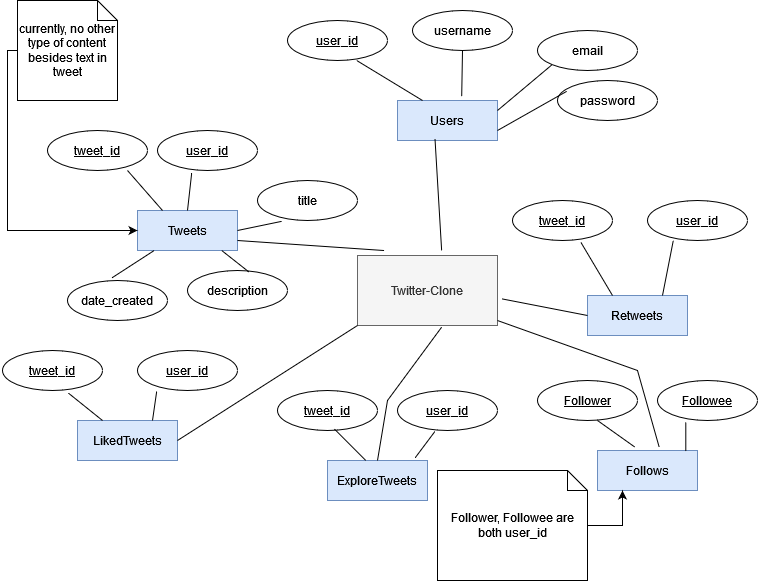

# TwitterBackend
### A REST api created in spring boot, utilizing a relational database for a project that aims to be a clone of twitter.

## Database ER model



## Before running 
Make a resources folder in src/main

Make an application.properties file in src/main/resources
```
spring.datasource.url=jdbc:postgresql://localhost:5432/twitterdb
spring.datasource.username=postgres
spring.datasource.password=passwordHere
server.port=3001
#spring.sql.init.mode=always

```

## Create a database called twitterdb in PostgreSQL
Run public/init.sql to create the database tables

Run public/data.sql to set up test data in the database

## To Run
### Have at least Java 16 installed
`.\mvnw spring-boot:run`
